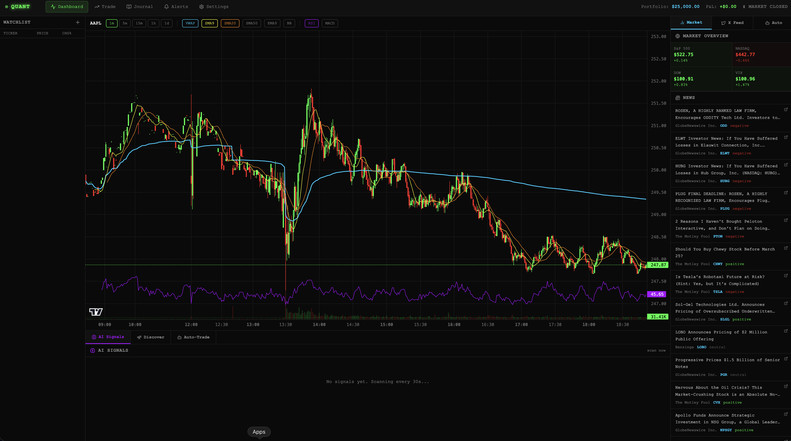

# QuantDash — AI-Powered Day Trading Dashboard

An AI-assisted intraday trading platform powered by Claude. Scans the market for setups, generates real-time trade signals, tracks paper and live positions, and can autonomously discover and execute trades.

[](https://vercel.com/new/clone?repository-url=https%3A%2F%2Fgithub.com%2FYOUR_USERNAME%2FYOUR_REPO)

> **No server API keys required.** Enter your own keys in **Settings** after deploying — they stay in your browser only.



---

## Quick Start (2 options)

### Option A — Deploy to Vercel (recommended, no setup)
1. Click the **Deploy with Vercel** button above
2. Follow the prompts to clone + deploy (free Vercel account required)
3. Open the app → go to **Settings** → enter your API keys

### Option B — Run locally
```bash
git clone <repo-url>
cd day-trading-app
npm install
npm run dev
# Open http://localhost:3000 → Settings → enter your API keys
```

---

## Features

### 📡 Live Market Data
- Real-time quotes, candlestick charts (1m / 5m / 15m / 1h / 1d), and OHLCV data via **Polygon.io**
- Technical indicators overlaid on chart: VWAP, SMA 9/20/50, EMA 9, Bollinger Bands, RSI, MACD
- Market indices (S&P 500, NASDAQ, DOW, VIX) and live news feed
- Configurable watchlist with per-ticker P&L tracking

### 🤖 AI Signal Engine (Claude)
- Analyzes each watchlist ticker using price action, volume, and all technical indicators
- Returns structured signals: **BUY / SELL / HOLD** with confidence score, entry, stop-loss, target, and R:R ratio
- Manual "Scan Now" button — no background polling without your consent

### 🔭 Stock Discovery
- Claude actively **searches the web** (using Anthropic's built-in web search tool) for today's best setups
- Finds earnings catalysts, analyst upgrades, breakouts, gap plays, and sector themes
- Seeds the search with Polygon's top gainers/losers if a Polygon key is configured
- Expandable recommendation cards: thesis, entry zone, risk, and sources Claude found
- One-click add to watchlist

### ⚡ Auto-Trade Engine
- Evaluates signals every 60 seconds and executes paper trades automatically
- Reuses signals generated by manual scans (no duplicate Claude calls within 5 min)
- Circuit breakers: daily loss limit, daily trade count, market-hours gate, per-ticker cooldown
- Supports X/Twitter sentiment confirmation before executing
- **Disabled in live mode by default** — requires explicit opt-in

### 📊 Paper & Live Trading
- Paper trading with a simulated $25,000 account — positions, orders, full P&L journal
- Live trading via **Alpaca** — real orders with SIPC-protected funds
- Separate API key management for paper and live; confirmation dialogs on every live order
- Live account panel showing real buying power, equity, and unrealized P&L

### 🐦 X / Twitter Scanner
- Scans cashtag mentions across r/wallstreetbets-style keywords
- Bullish/bearish/neutral sentiment scoring per ticker
- Optional X sentiment confirmation gate in the auto-trade engine

### 💰 API Cost Tracker
- Tracks exact Claude token usage (input + output) and calculates real USD cost
- Monitors Polygon call count, X API reads (with free-tier progress bar), and Alpaca calls
- Reset button for per-session tracking; persisted across page reloads

### 🔔 Price Alerts
- Set price, RSI, volume, and breakout alerts per ticker
- Browser notifications on trigger

---

## Tech Stack

| Layer | Technology |
|---|---|
| Framework | Next.js 14 (App Router) |
| Language | TypeScript |
| Styling | Tailwind CSS (custom dark theme) |
| Charts | lightweight-charts |
| State | Zustand (persisted to localStorage) |
| AI | Anthropic Claude Sonnet (`claude-sonnet-4-6`) |
| Market Data | Polygon.io |
| Brokerage | Alpaca Markets |
| Social | X (Twitter) API v2 |

---

## Getting Started

### 1. Install dependencies

```bash
npm install
```

### 2. Run the development server

```bash
npm run dev
```

Open [http://localhost:3000](http://localhost:3000).

### 3. Add your API keys

Navigate to **Settings** and enter your keys. All keys are stored locally in your browser — never sent to any server other than their respective APIs.

| Key | Where to get it | Required? |
|---|---|---|
| **Anthropic API Key** | [console.anthropic.com](https://console.anthropic.com) | Yes — powers all AI features |
| **Polygon.io API Key** | [polygon.io](https://polygon.io) | Optional — live market data (falls back to mock data) |
| **Alpaca Paper Key + Secret** | [paper.alpaca.markets](https://paper.alpaca.markets) | Optional — paper trade execution |
| **Alpaca Live Key + Secret** | [alpaca.markets](https://alpaca.markets) | Optional — real-money trading |
| **X Bearer Token** | [developer.twitter.com](https://developer.twitter.com) | Optional — social sentiment scanner |

> **Note:** The app is fully functional with mock data if you only have an Anthropic key. Live prices and order execution require their respective keys.

---

## Usage Guide

### Manual AI Scan
Click **"scan now"** in the AI Signals panel. Claude analyzes your top 3 watchlist tickers (selected + 2 others) using all available technical data and returns trade signals.

### Stock Discovery
Click the **Discover** tab → **Scan Now**. Claude searches the web for today's top setups, catalysts, and breakouts. Each recommendation can be expanded for the full thesis and added to your watchlist in one click.

### Auto-Trade
Enable in the **Auto-Trade** panel. The engine runs every 60 seconds, evaluates signals, and executes paper trades when confidence exceeds your threshold. Configure circuit breakers (daily loss limit, trade count) in the settings panel.

### Live Trading
1. Enter your live Alpaca keys in Settings → **Alpaca Live Keys**
2. Switch to **Live Mode** in Settings → Trading Mode
3. Every order requires a confirmation dialog
4. Auto-trade is disabled in live mode by default

---

## Cost Estimates (Claude API)

Each AI scan calls Claude Sonnet once per ticker analyzed. At current pricing ($3.00/M input tokens, $15.00/M output tokens):

| Usage | Estimated Cost |
|---|---|
| Manual scan (3 tickers) | ~$0.01–0.05 per click |
| Auto-trade ON, 3 tickers, market hours (6.5h) | ~$0.50–2.00/day |
| Stock Discovery scan | ~$0.05–0.20 per scan (includes web search) |

Set a [spend limit on console.anthropic.com](https://console.anthropic.com) to cap costs. Track real usage in **Settings → API Usage & Costs**.

---

## Project Structure

```
day-trading-app/
├── app/
│   ├── page.tsx              # Main dashboard layout
│   ├── trade/page.tsx        # Order entry + positions
│   ├── journal/page.tsx      # Trade history + stats
│   ├── alerts/page.tsx       # Price alert management
│   ├── settings/page.tsx     # API keys + cost tracker
│   └── api/
│       ├── ai/analyze/       # Claude signal generation
│       ├── ai/discover/      # Claude stock discovery (web search)
│       ├── market/quotes/    # Polygon.io snapshot
│       ├── market/candles/   # Polygon.io OHLCV
│       ├── market/news/      # Polygon.io news
│       ├── social/x/         # X API v2 tweet scanner
│       └── trade/            # Alpaca order + account
├── components/
│   ├── AISignalPanel.tsx     # Signal display + manual scan
│   ├── StockDiscovery.tsx    # AI-powered stock finder
│   ├── AutoTradePanel.tsx    # Auto-trade engine UI
│   ├── CandlestickChart.tsx  # lightweight-charts integration
│   ├── Watchlist.tsx         # Ticker list + quote polling
│   ├── MarketOverview.tsx    # Indices + news feed
│   ├── XScanner.tsx          # Twitter sentiment feed
│   ├── TradePanel.tsx        # Order entry form
│   └── LiveAccountPanel.tsx  # Alpaca account display
├── lib/
│   ├── store.ts              # Zustand state + API usage tracking
│   ├── types.ts              # TypeScript interfaces
│   ├── indicators.ts         # VWAP, RSI, MACD, BB calculations
│   ├── autoTrade.ts          # Auto-trade engine hook
│   └── utils.ts              # Formatting + market hours helpers
```

---

## Disclaimer

This application is for **educational and simulation purposes only**. AI signals are not financial advice. Paper trading results do not guarantee live trading performance. Always use proper risk management. The authors are not responsible for any financial losses.
